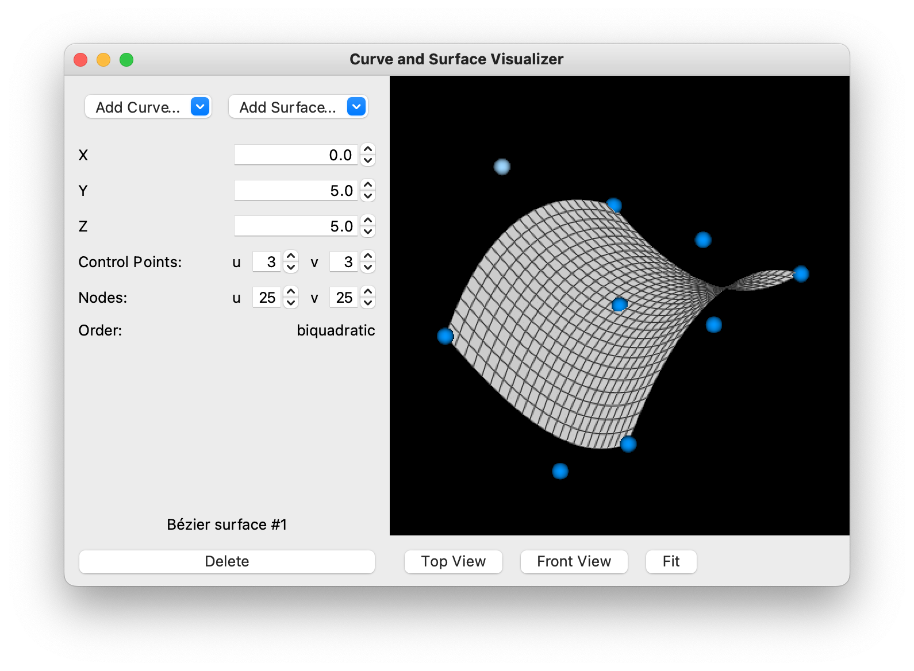

# Curve and Surface Visualizer
A GUI program for viewing and modifying curves and surfaces in 3D, written in Python.

## Features
- Visualize Bézier, Hermite, and B-spline curves and surfaces
- Modify a control point by clicking and dragging it or by editing values
- Change the number of control points, the number of nodes, and the order
- Select multiple geometries of the same type to view their continuity
- Export geometries shown in the window as an image

## Usage
### Adding geometries
Click the appropriate button in the sidebar to add a new curve or surface, and select the specific type in the dropdown menu.

The default number of control points and number of nodes used for new geometries can be changed in the settings.

### Selecting geometries
Click a geometry in the visualizer or in the list view to automatically populate the fields with its information. Hold Shift or Control/Command to select multiple geometries in the visualizer or in the list view.

Select two or more of the same geometry to display their continuity in the sidebar.

### Modifying geometries
Click and drag a control point in the visualizer to modify its position, or edit its coordinates in the sidebar.

Change the number of control points and nodes of a geometry by editing the fields in the sidebar. The order of the selected geometry is automatically shown. If the geometry's order can be changed, an editable field appears. Edit these fields while multiple geometries are selected to modify all geometries simultaneously. Fields that are not applicable to the selected geometries are automatically disabled.

Translate a geometry by clicking and dragging it in the visualizer. Translate multiple geometries simultaneously by holding Shift or Control/Command.

### Removing geometries
Click the Delete button to remove the currently selected geometries, or press Backspace after selecting geometries in the list view.

### Exporting as image
Export the visualizer window as an image by selecting the option in the File menu or pressing Control/Command-S.

The properties of exported images can be changed in the settings.

## Dependencies
- NumPy (calculations of geometry)
- PyQt5 (graphical user interface)
- VTK 9 (visualization of 3D geometry)

## Running
Run this program by downloading the executable file or downloading and running the source code.

### Executable file
Download the appropriate executable file [here]().

To create the executable file, download all source code, and install PyInstaller using: `pip install pyinstaller`. Then create the executable file using the `.spec` file for the desired operating system using: `pyinstaller <filename>.spec`.

### Running from source
Download the source code and install all dependencies using: `pip install -r requirements.txt`. Run `main.py` to start the program.