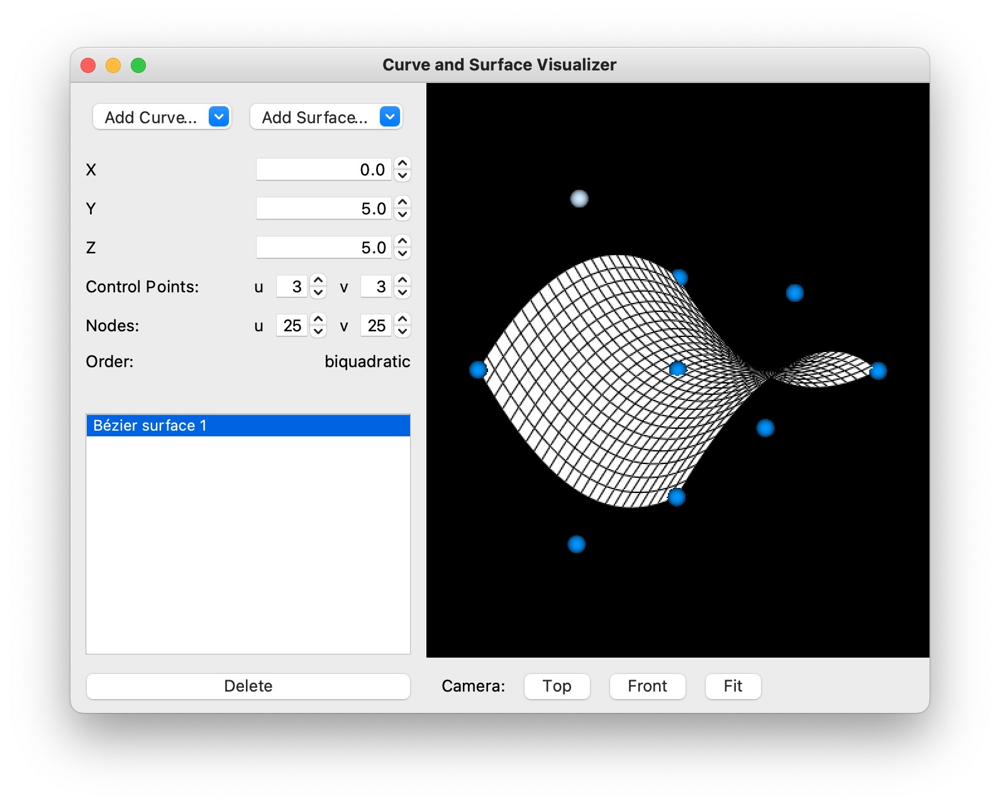

# Curve and Surface Visualizer
A GUI program for viewing and modifying curves and surfaces in 3D, written in Python.

## Features
- Visualize Bézier, Hermite, and B-spline curves and surfaces
- Modify a control point by clicking and dragging it, or by typing values
- Specify the number of control points, number of nodes, and the order
- Select multiple geometries of the same type to view their continuity

## Dependencies
- NumPy (calculations of geometry)
- PyQt5 (graphical user interface)
- VTK 9 (visualization of 3D geometry)

## Running
This program can be run either by downloading the executable file or by downloading and running the source code.

### Executable file
Download the executable file [here]().

### Running from source
Download the source code and run `main.py`. Make sure all dependencies are installed.